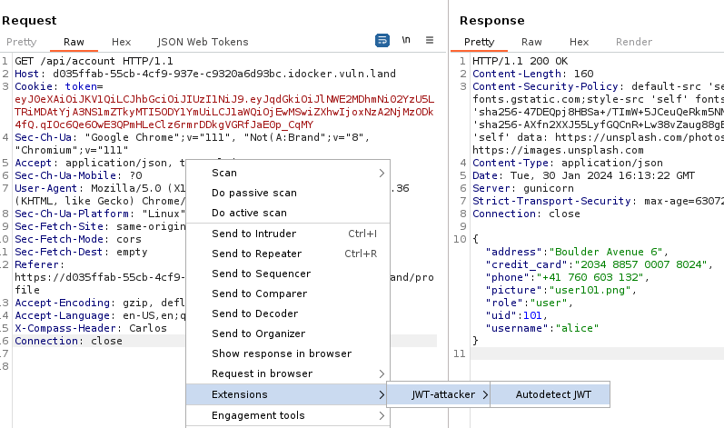

# JWT-attacker - Burp Extension
## Description
JWT Attacker is a Burp Suite extension for automated testing of Jason Web Token (JWT) implementations of web applications. 

### Checks
- Signature presence
- Invalid signatures
- Signatures with empty passwords
- Usage of algorithm none variations
- Invalid ECDSA parameters (CVE-2022-21449)
- JWT JWK injection

## Features
- Active Scanner
- Select base request and autodetection of JWT
- Manually select target JWT in source request

## Usage
Run an active scan or manually select a request from to check:

1. Go to  Proxy / Repeater / Target / Logger / Intruder
2. Select request that requires a authentication with a valid JWT and returns a HTTP 200 response
> **_NOTE:_** First the extension will resend the selected request without modification and check if the JWT is still valid. If not a Error will be displayed in the Event Log

### Automatically detect JWT
3. Right-click on the request you want to check.
4. Extension -> JWT-attacker -> Autodetect JWT
5. In case of a identified vulnerability a issue is generated

Autodetect JWT from valid request:

### Manually select JWT
3. Highlight the target JWT in request
4. Right-click highlighted JWT request
5. Extension -> JWT-attacker -> Selected JWT
6. In case of a identified vulnerability a issue is generated

## Installation
1. Download the latest pre-built jar file from [releases](https://github.com/CompassSecurity/jwt-attacker/releases).
2. Extender -> Tab Installed -> Add -> Extension Details -> Extension Type: *Java* -> Select file ...
3. Select the downloaded jar

Manually select JWT from valid request:


## Build
Using maven to build jar file with dependencies:
```shell
mvn package -f pom.xml
```